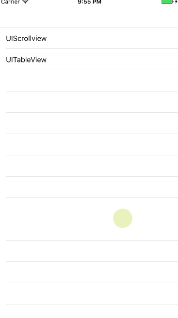

# FlurryCover
简单封装下拉模糊效果  

使用说明
=======
###导入文件
将项目目录下的`FlurryCover`目录导入项目中
`SIFlurryCover`:UIImageView子类,实现模糊效果
`UIScrollView+SIFlurryCover`:UIScrollView的分类,添加头部下拉模糊

###导入投文件
	#import "UIScrollView+SIFlurryCover.h"
	
###添加下拉模糊头部
	// tableView添加
	[tableView addFlurryCoverWithImage:[UIImage imageNamed:@"cover"]];
	// scrollView添加
	[scrollView addFlurryCoverWithImage:[UIImage imageNamed:@"cover"]] ;
	
###注意事项
* 需要在视图的`dealloc`中移除,需要调用以下方法

		-(void)dealloc{
    		[scrollView removeFlurryCoverView] ;
		}
* 不要使用高质量图片,会增加内存的占用

